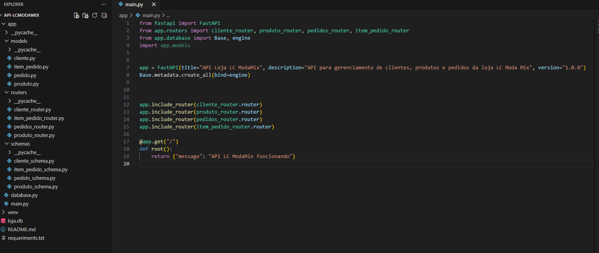
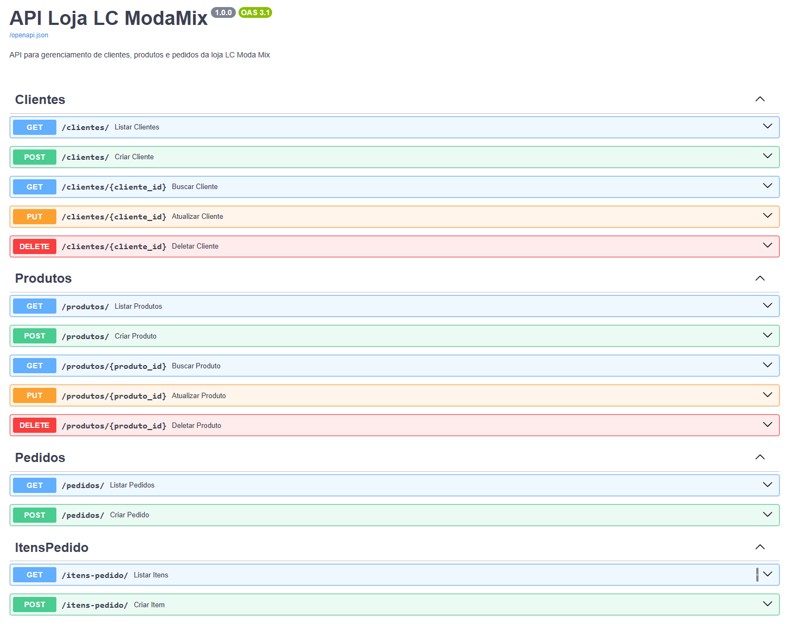

## 👩‍💻 Autora  

---

# 🛍️ API LC Moda Mix – Sistema de Gestão de Pedidos

Este projeto é uma **API REST para gerenciamento de uma loja de roupas**, desenvolvida em **Python com FastAPI**, permitindo o cadastro de clientes, produtos, pedidos e itens de pedidos.

O objetivo do projeto é praticar conceitos fundamentais de **desenvolvimento backend**, como:

- Estruturação de **APIs REST**
- Modelagem de **banco de dados relacional**
- **Relacionamentos entre entidades**
- Organização de código em **camadas**
- Validação de dados
- Manipulação de banco de dados com ORM

---

## 💡 Sobre o Projeto

A aplicação simula o backend de uma **loja de roupas**, permitindo controlar todo o fluxo de vendas.

A API possibilita:

- Cadastro de clientes
- Cadastro de produtos
- Criação de pedidos
- Adição de itens aos pedidos
- Consulta de pedidos com seus itens relacionados

O sistema utiliza **relacionamentos entre tabelas**, simulando o funcionamento real de um **sistema de e-commerce ou ERP de vendas**.

Estrutura de relacionamento:

Cliente → Pedido → Itens do Pedido → Produto

---

## 🚀 Tecnologias Utilizadas

---

## 📦 Bibliotecas Utilizadas

- `fastapi` → Criação da API REST  
- `sqlalchemy` → ORM para manipulação do banco de dados  
- `pydantic` → Validação de dados  
- `uvicorn` → Servidor ASGI  
- `datetime` → Manipulação de datas  

---

## ⚙️ Funcionalidades

- ✅ Cadastro de clientes  
- ✅ Cadastro de produtos  
- ✅ Criação de pedidos  
- ✅ Adição de itens ao pedido  
- ✅ Listagem de pedidos com seus itens  
- ✅ Relacionamento entre tabelas do banco  
- ✅ Estrutura REST organizada  
- ✅ Tratamento de erros HTTP  

Exemplos de respostas da API:

- `200` → Operação realizada com sucesso  
- `404` → Recurso não encontrado  
- `422` → Erro de validação de dados  

---

## 🧱 Estrutura do Projeto

---

## 🔗 Endpoints Principais

